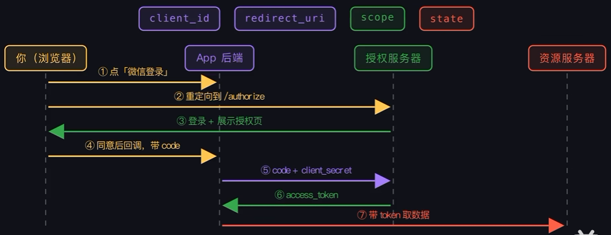

# Aegis PA 后端

## 本地开发环境

后端使用 Python 3.12、FastAPI、SQLAlchemy Async、PostgreSQL、Redis 和 Keycloak OIDC。

安装项目及开发依赖：

```powershell
cd D:\AI\Aegis_Agent_main\Aegis_backend
D:\anaconda\envs\Aegis\python.exe -m pip install -e ".[dev]"
```

从 `.env.example` 复制一份 `.env`，填写数据库、Redis 与 OIDC 配置。`.env` 不得提交到 Git。模型与 MCP 配置位于独立的 `aegis_agent_worker/.env`。

运行基础设施测试：

```powershell
D:\anaconda\envs\Aegis\python.exe -m pytest tests/config -q
```

运行全部后端测试：

```powershell
D:\anaconda\envs\Aegis\python.exe -m pytest tests -q
```

## 最小可观测性

API 与独立 Agent Worker 均接入 OpenTelemetry 自动埋点和 JSON 结构化日志。请求的 W3C `traceparent` 会随 Redis Agent 队列传到 Worker，因此同一任务的 API、Worker、模型请求和 Calendar MCP 请求可通过日志中的 `trace_id` 关联。

默认只生成 Trace Context 与 JSON 日志，不向外部追踪平台导出数据。若本地需要直接在两个终端查看完整 Span，请在 `Aegis_backend/.env` 与 `aegis_agent_worker/.env` 中设置并分别重启 API 与 Worker：

API 的 `.env`：

```dotenv
OTEL_ENABLED=true
OTEL_SERVICE_NAME=aegis-pa-api
OTEL_CONSOLE_EXPORTER=true
```

Worker 的 `.env`：

```dotenv
OTEL_ENABLED=true
OTEL_SERVICE_NAME=aegis-agent-worker
OTEL_CONSOLE_EXPORTER=true
```

日志仅输出任务和工具关联标识、状态、错误码和耗时；不应记录 access token、API Key、模型提示词、邮件正文或第三方凭据。

## 数据库迁移（Alembic）

数据库结构从当前版本起由 Alembic 管理。历史初始化脚本及其后续结构演进已固化为以下迁移版本：

```text
001_initial_schema
002_msg_client_id_uq
003_mail_background_runs
004_todo_plan_management
```

新建的空数据库使用以下命令初始化：

```powershell
D:\anaconda\envs\Aegis\python.exe -m alembic upgrade head
```

已按旧版 `scripts/001_initial_schema.sql` 和 `scripts/002_fix_message_client_id_unique_constraint.sql` 初始化的数据库，**不要**再次执行 `upgrade head`，否则会重复建表。确认数据库结构已处于旧脚本对应状态后，使用：

```powershell
D:\anaconda\envs\Aegis\python.exe -m alembic stamp 002_msg_client_id_uq
```

`stamp` 只写入 Alembic 的版本记录，不会修改已有业务表或数据。之后的数据库变更应新增 `migrations/versions/` 下的迁移文件，不再新增手工建表 SQL。

常用命令：

```powershell
# 查看当前数据库迁移版本
D:\anaconda\envs\Aegis\python.exe -m alembic current

# 查看本代码版本的最新迁移
D:\anaconda\envs\Aegis\python.exe -m alembic heads

# 创建后续迁移骨架；实际 DDL 需人工审核，尤其是 RLS、触发器和分区表
D:\anaconda\envs\Aegis\python.exe -m alembic revision -m "add calendar draft approval"
```

## 当前已实现的会话与任务接口

启动服务后可访问 Swagger：`http://127.0.0.1:8000/docs`。下列接口都要求请求头包含 `Authorization: Bearer <access_token>`；后端验证 Keycloak token 并按本地 `tenant_id + user_id` 限制数据范围。

| 方法 | 当前路径 | 用途 |
|---|---|---|
| `POST` | `/conversations` | 创建当前用户的新会话 |
| `GET` | `/conversations` | 获取当前用户的历史会话摘要 |
| `GET` | `/conversations/{conversation_id}` | 恢复一个会话的可见消息、运行进度、工具预览及确认项 |
| `POST` | `/conversations/{conversation_id}/messages` | 保存用户任务消息，并创建初始状态为 `queued` 的任务运行 |
| `GET` | `/runs/{run_id}` | 查询当前用户任务的状态、模型信息、进度步骤、结果摘要或脱敏错误 |
| `GET` | `/runs/{run_id}/events` | 以 SSE 补发并实时推送当前任务的进度、回复、完成或失败事件 |
| `GET` | `/mail/messages` | 同步当前用户已授权邮箱的邮件元数据快照；不返回邮件正文 |
| `GET` | `/mail/messages/{email_id}` | 按需读取当前用户单封邮件的正文与附件元数据；不触发 LLM 或写操作 |
| `GET` | `/mail/drafts` | 列出当前用户保存的站内邮件草稿；列表不返回正文 |
| `GET` | `/mail/drafts/{draft_id}` | 查看一封站内草稿的完整正文和收件人 |
| `PATCH` | `/mail/drafts/{draft_id}` | 修改 `draft` 状态的站内草稿；不会发送邮件 |
| `POST` | `/mail/drafts/{draft_id}/send-confirmations` | 冻结草稿并创建单项邮件发送确认；不会立即发送 |
| `GET` | `/mail/sent-messages` | 列出当前用户的已发送邮件记录 |
| `POST` | `/mail/{email_id}/extraction-requests` | 提交或复用邮件摘要、待办及截止时间候选提取任务 |
| `POST` | `/mail/{email_id}/reply-draft-requests` | 提交邮件回复草稿生成任务；不会发送邮件 |
| `POST` | `/mail/{email_id}/todo-drafts` | 将已完成摘要中的待办候选复制为站内待办草稿；不调用 LLM |
| `GET` | `/todos` | 列出当前用户的站内待办计划；默认隐藏丢弃项 |
| `GET` | `/todos/{todo_id}` | 读取一项待办及其邮件来源摘要 |
| `GET` / `POST` | `/memories` | 搜索或手动新增当前用户的长期记忆 |
| `GET` / `PATCH` | `/memories/{memory_id}` | 查看或编辑一条长期记忆 |
| `POST` | `/memories/confirm` | 从当前用户拥有的任务明确确认并保存记忆 |
| `POST` | `/memories/{memory_id}/deletion-requests`、`/delete` | 发起并确认软删除长期记忆 |
| `PATCH` | `/todos/{todo_id}` | 编辑待办、标记完成或丢弃；不会创建外部日程 |

当前开发版本尚未挂载 `/api/v1` 前缀。查询其他用户的会话不会暴露其存在性，统一返回 `404`。发送消息时，前端必须提交 `client_message_id`；同一会话内重复提交相同标识会复用原消息和任务，而不会重复创建任务。

## 邮件列表同步（3.3 第一步）

`GET /mail/messages` 仅由浏览器调用 Aegis 主后端。后端从已认证用户取得租户和用户 ID，查找状态为 `active` 且包含 `mail.read` scope 的 `gmail` 或 `outlook_mail` 连接，调用 Email MCP Server 的 `mail.messages.list`，并以“用户 + 连接 + 外部邮件 ID”更新 `email_messages` 元数据快照。邮件正文不会保存或返回给列表页面。

用户点击“生成摘要”后，主后端创建 `mail_extraction` 后台任务并返回 SSE 地址；Worker 通过 `mail.messages.get` 读取正文、调用 LLM，并保存 `mail_extractions` 与待办候选。用户点击“起草回复”同样会创建 `mail_reply_draft` 后台任务；完成事件带有 `draft_id`，站内草稿会出现在 `GET /mail/drafts`，但不会调用任何邮件发送工具。草稿列表不会返回正文；完整正文仅通过 `GET /mail/drafts/{draft_id}` 返回给草稿所属用户。`PATCH /mail/drafts/{draft_id}` 只允许 `draft` 状态。用户调用 `POST /mail/drafts/{draft_id}/send-confirmations` 后，服务冻结草稿版本并生成独立 `mail_send` 确认项；批准后 Worker 才调用 `mail.messages.send`，成功时更新草稿为 `sent` 并写入 `sent_mail_messages`。

本地 Mock 联调时，先启动 `Email_mcp_server`，在 `Aegis_backend/.env` 中配置：

```dotenv
EMAIL_MCP_URL=http://127.0.0.1:9002/mcp
EMAIL_MCP_TIMEOUT_SECONDS=20
```

随后在 DataGrip 中执行一次 [004_seed_mock_email_connection.sql](scripts/004_seed_mock_email_connection.sql)，为当前 Keycloak Jason 用户创建含 `mail.read` 和 `mail.send` scope 的 Mock 连接。若未创建连接，接口返回 `409 CONNECTION_REQUIRED`；若 MCP 服务不可用，返回 `503 MAIL_TOOL_UNAVAILABLE`，不会返回虚构邮件。

## 第一版 Agent Worker 与 LLM 链路

第一版已实现“文本任务 → 可控的只读日历 MCP 查询 → LLM 文本回复 → SSE 状态/结果通知”，以及独立的邮件摘要、待办候选、回复草稿与经逐项确认的邮件发送任务。邮件发送当前只写入 Mock 已发送箱，不会发送真实邮件。任务处理流程如下：

```text
POST /conversations/{conversation_id}/messages
→ PostgreSQL：写入用户消息和 queued agent_run
→ 数据库事务提交后：将 run_id 和 W3C traceparent 写入 Redis 列表队列
→ Agent Worker：取出任务并恢复 Trace Context，将任务更新为 running
→ 命中日历意图时：调用 Calendar MCP 的只读日程/可用时间工具，保存 tool_calls
→ 读取该会话最近 20 条消息，调用 OpenAI 兼容 Chat Completions 接口
→ PostgreSQL：保存 run_events、assistant 消息、run_steps，并将任务更新为 completed 或 failed
→ Redis Pub/Sub：通知 SSE API 实例向前端推送新增事件
```

除启动 API 外，另开一个终端启动 Worker：

```powershell
cd D:\AI\Aegis_Agent_main\aegis_agent_worker
D:\anaconda\envs\Aegis\python.exe -m aegis_agent_worker
```

确保 `aegis_agent_worker/.env` 中的 Redis 与模型配置可用：

```dotenv
REDIS_URL=redis://127.0.0.1:6379/0
AGENT_QUEUE_NAME=aegis:agent-runs
MODEL_PROVIDER=openai
MODEL_API_BASE=https://api.openai.com/v1
MODEL_API_KEY=你的模型密钥
MODEL_DEFAULT_NAME=gpt-4.1-mini
```

DeepSeek 使用 OpenAI 兼容 Chat Completions 协议，也可配置为：

```dotenv
MODEL_PROVIDER=deepseek
MODEL_API_BASE=https://api.deepseek.com/v1
MODEL_API_KEY=你的 DeepSeek 密钥
MODEL_DEFAULT_NAME=deepseek-chat
```

如果 Worker 未启动，消息接口仍会成功创建 `queued` 任务，但不会产生 Agent 回复；Worker 启动后会消费后续投递到 Redis 的任务。Redis 中只存储 `run_id`，会话内容和模型结果始终存储在 PostgreSQL。

## SSE 实时任务事件

发送消息成功后，前端可在保留轮询兜底的同时订阅：

```text
GET /runs/{run_id}/events
Authorization: Bearer <access_token>
Last-Event-ID: <最近已处理的 event_no，可选>
```

服务端先按 `event_no` 从 PostgreSQL `run_events` 补发断线期间漏掉的事件，再订阅 Redis Pub/Sub 通道 `aegis:run:{run_id}:events` 接收实时通知。每条事件均已先写入数据库；Redis 通知短暂失败不会丢失事件，下次连接仍可补发。

当前第一版会产生以下事件：

| 事件名 | `data.payload` 关键内容 | 前端行为 |
|---|---|---|
| `run_started` | 状态、当前阶段、模型提供方和模型名 | 将任务标记为运行中 |
| `progress_updated` | 步骤 ID、标签、状态 | 更新右侧进度 |
| `assistant_message_completed` | 最终回复 `content` | 在对话区写入 Agent 完整消息 |
| `run_completed` | 完成状态、结果摘要 | 停止本任务的轮询和 SSE 订阅 |
| `run_failed` | 失败状态、脱敏错误码和提示 | 展示失败提示并停止订阅 |
| `tool_preview` | 工具名、风险、查询条件和只读结果摘要 | 展示右侧工具预览 |
| `connection_required` | 所需日历连接与权限提示 | 展示连接日历提示 |

SSE 帧中的 `id` 等于 `event_no`，前端应保存最近成功处理的编号，并在重连时放入 `Last-Event-ID`。由于浏览器原生 `EventSource` 不能附加 `Authorization` 请求头，当前 Bearer Token 认证方案下应使用 `fetch` 的流式读取（`ReadableStream`）订阅该接口；不要把 access token 拼接到 URL 查询参数。`GET /runs/{run_id}` 仍建议保留为页面刷新、SSE 不可用时的轮询兜底，最终可通过 `GET /conversations/{conversation_id}` 恢复完整会话。

已在旧版本数据库执行过初始化脚本时，还需要执行一次消息幂等约束修复脚本；它只修复 `client_message_id` 的唯一约束，不删除业务数据：

```powershell
psql -h 127.0.0.1 -U aegis_app -d aegis_pa -f scripts/002_fix_message_client_id_unique_constraint.sql
```

## Keycloak OIDC 本地配置

开发环境使用本机 Docker Keycloak 完成登录认证。Aegis 不保存用户密码；Keycloak 签发 access token，后端随后验证 token 的签名、签发者、受众和过期时间。

### 1. 启动 Keycloak

确保 Docker Desktop 已启动后执行：

```powershell
docker run --name aegis-keycloak `
  -p 127.0.0.1:8080:8080 `
  -e KC_BOOTSTRAP_ADMIN_USERNAME=admin `
  -e KC_BOOTSTRAP_ADMIN_PASSWORD=admin `
  quay.io/keycloak/keycloak:26.7.4 start-dev
```

首次执行会下载镜像并创建容器。后续可在 Docker Desktop 的 **Containers** 页面启动 `aegis-keycloak`，或执行：

```powershell
docker start aegis-keycloak
```

打开 `http://127.0.0.1:8080/admin`，使用 `admin/admin` 登录管理控制台。该账户仅限本地开发，不能用于生产环境。

### 2. 创建 Realm 与测试用户

1. 在管理控制台创建 Realm：`aegis`。
2. 在 **Users → Add user** 创建测试用户，例如 `jason`。
3. 为用户设置密码，并将 **Temporary** 关闭；可设置邮箱并标记为已验证。

### 3. 创建前端登录 Client

在 `aegis` Realm 内，进入 **Clients → Create client**，创建：

```text
Client type: OpenID Connect
Client ID: aegis-pa-web
Client authentication: Off
Standard flow: On
```

在登录设置中配置 Vue 开发地址：

```text
Root URL: http://localhost:5173
Valid redirect URIs: http://localhost:5173/*
Web origins: http://localhost:5173
```

### 4. 创建 API Audience Client

再次创建一个 Client：

```text
Client type: OpenID Connect
Client ID: aegis-pa-api
Client authentication: Off
Standard flow: Off
Direct access grants: Off
```

`aegis-pa-api` 不负责网页登录，而是 Aegis 后端 API 的资源标识。

### 5. 配置 Audience Mapper

进入：

```text
Clients → aegis-pa-web → Client scopes → aegis-pa-web-dedicated
→ Configure a new mapper → Audience
```

填写并保存：

```text
Name: aegis-pa-api-audience
Included Client Audience: aegis-pa-api
Add to access token: On
```

在 **Client scopes → Evaluate** 中选择测试用户并点击 **Generate access token**。生成的 access token 的 Payload 必须包含：

```json
{
  "aud": ["aegis-pa-api", "account"]
}
```

`aud` 为字符串或数组均可；后端只要求其包含 `aegis-pa-api`。不要把真实 access token 写入仓库、截图或聊天记录。

### 6. 配置后端环境变量

当前本地 Keycloak 实际签发的 `iss` 为 `http://127.0.0.1:8080/realms/aegis`，因此 `.env` 中必须使用同一地址：

```dotenv
OIDC_ISSUER_URL=http://127.0.0.1:8080/realms/aegis
OIDC_AUDIENCE=aegis-pa-api
OIDC_CLIENT_ID=aegis-pa-web
```

首次使用 Keycloak 测试用户时，用户尚不存在于 Aegis 的 `users` 表。仅在本地开发环境，可额外开启自动映射：

```dotenv
AUTO_PROVISION_USERS=true
DEFAULT_TENANT_NAME=aegis-dev
```

后端会在 `aegis-dev` 租户中创建或复用该 OIDC 用户。生产环境必须保持 `AUTO_PROVISION_USERS=false`，由管理员预先创建用户与租户成员关系，不能让任意外部身份自动加入已有租户。

可访问以下 Discovery 地址确认 Keycloak 正常运行：

```text
http://127.0.0.1:8080/realms/aegis/.well-known/openid-configuration
```

后端令牌验证将使用该配置中的 JWKS 公钥地址，并校验：

- `iss` 必须等于 `OIDC_ISSUER_URL`；
- `aud` 必须包含 `OIDC_AUDIENCE`；
- token 签名有效且未过期；
- 使用 `iss + sub` 查找或创建 Aegis 本地用户。
