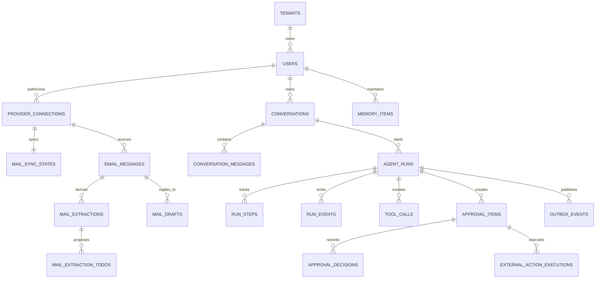

# Aegis PA 第 01 期数据库设计

> 本文合并了原《第01期-数据库设计》与《第01期-数据库字段说明》，是第 01 期唯一的数据库设计与实施数据字典。以 PostgreSQL 16+ 为业务事实来源、Redis 为可重建短期状态；所有时间均为 UTC。`uuid` 由服务端生成，`jsonb` 为结构化快照或扩展数据，敏感正文、草稿和令牌在应用层加密或脱敏后再写入。
>
> “接口”列写出直接读写该字段的公开接口；`内部`表示仅由 Agent、Worker 或 MCP 适配层调用，不向浏览器开放。“功能”列采用《第01期-项目预期功能与使用示例.md》的编号。

## 1. 设计范围与统一约定

- 一期覆盖对话任务与 SSE 进度、日历草稿与确认创建、邮件同步/提取/草稿与确认发送，以及用户手动维护的长期记忆。
- PostgreSQL 保存业务事实、确认、幂等、审计和 SSE 回放事件；Redis 仅保存可丢失或可重建的限流、在线游标、Celery Broker/结果及临时 checkpoint。
- 原始邮件正文、附件全文和 OAuth access/refresh token 不写入业务表。邮件正文只在摘要或起草时临时处理；数据库仅保存内容哈希、脱敏预览和密钥管理系统的凭据引用。
- 除 `tenants` 外，业务表都包含 `tenant_id`。前端传入的租户标识不可信，服务端必须从认证上下文取得租户和用户。
- 一期不创建 embedding、向量索引、AI 自动记忆或记忆置信度；二期再通过独立迁移启用 pgvector。

### 1.1 关键关系



## 2. 字段级表设计

### 2.1 租户、用户与已授权连接

#### 2.1.1 `tenants`（租户）

| 列名 | 描述 | 数据类型（精度范围） | 空/非空 | 约束条件 | 哪几个接口会用 | 哪几个功能会用 |
| - | - | - | - | - | - | - |
| `id` | 租户主键 | `uuid` | 非空 | PK；默认 `gen_random_uuid()` | 全部需鉴权的接口（从令牌解析） | 全部第 01 期功能 |
| `name` | 组织/个人工作区名称 | `varchar(128)` | 非空 | 同一部署内唯一 | 管理端接口（预留） | 租户隔离基础能力 |
| `status` | 租户状态 | `varchar(32)` | 非空 | `active`、`disabled`；默认 `active` | 全部需鉴权的接口 | 全部第 01 期功能 |
| `created_at` | 创建时间 | `timestamptz` | 非空 | 默认 `now()` | 管理端接口（预留） | 租户管理（后续） |
| `updated_at` | 最近更新时间 | `timestamptz` | 非空 | 更新时由服务端维护 | 管理端接口（预留） | 租户管理（后续） |

#### 2.1.2 `users`（用户）

| 列名 | 描述 | 数据类型（精度范围） | 空/非空 | 约束条件 | 哪几个接口会用 | 哪几个功能会用 |
| - | - | - | - | - | - | - |
| `id` | 用户主键 | `uuid` | 非空 | PK；默认生成 UUID | 全部用户接口（从访问令牌解析） | 全部第 01 期功能 |
| `tenant_id` | 所属租户 | `uuid` | 非空 | FK → `tenants.id`；索引 | 全部用户接口 | 全部第 01 期功能 |
| `oidc_issuer` | OIDC 身份提供方签发者 | `varchar(512)` | 非空 | 与 `oidc_subject` 联合唯一；不保存密码 | 登录回调、全部需鉴权接口 | 全部第 01 期功能 |
| `oidc_subject` | OIDC 用户主体标识 | `varchar(512)` | 非空 | 与 `oidc_issuer` 联合唯一 | 登录回调、全部需鉴权接口 | 全部第 01 期功能 |
| `email` | 登录邮箱 | `varchar(320)` | 非空 | 格式校验；建立 `(tenant_id,email)` 索引，不以邮箱作为登录身份唯一键 | 全部需鉴权接口 | 全部第 01 期功能 |
| `display_name` | 页面显示名 | `varchar(128)` | 非空 | 去首尾空格后长度 1–128 | 会话、日历、邮件、记忆接口 | 3.1、3.2、3.3、3.4、3.7、3.8 |
| `timezone` | 用户时区 | `varchar(64)` | 非空 | IANA 时区名；默认 `Asia/Shanghai` | 日历草稿、邮件、记忆接口 | 3.2、3.3、3.7 |
| `status` | 账号状态 | `varchar(32)` | 非空 | `active`、`disabled`；默认 `active` | 全部需鉴权接口 | 全部第 01 期功能 |
| `created_at` | 创建时间 | `timestamptz` | 非空 | 默认 `now()` | 管理端接口（预留） | 用户与租户管理（后续） |
| `updated_at` | 最近更新时间 | `timestamptz` | 非空 | 服务端维护 | 管理端接口（预留） | 用户与租户管理（后续） |

#### 2.1.3 `provider_connections`（第三方授权连接）

| 列名 | 描述 | 数据类型（精度范围） | 空/非空 | 约束条件 | 哪几个接口会用 | 哪几个功能会用 |
| - | - | - | - | - | - | - |
| `id` | 连接主键 | `uuid` | 非空 | PK | 内部工具网关；第 02 期连接管理接口 | 3.2、3.3、3.4；第 02 期 3.9 |
| `tenant_id` | 所属租户 | `uuid` | 非空 | FK → `tenants.id`；索引 | 内部工具网关 | 同上 |
| `user_id` | 授权用户 | `uuid` | 非空 | FK → `users.id`；索引 | 内部工具网关 | 3.2、3.3、3.4 |
| `provider` | 服务提供方 | `varchar(32)` | 非空 | 枚举：`google_calendar`、`outlook_calendar`、`gmail`、`outlook_mail` | 内部工具网关 | 3.2、3.3、3.4 |
| `provider_account_id` | 提供方账户标识 | `varchar(255)` | 非空 | 与 `tenant_id`、`user_id`、`provider` 联合唯一 | 内部工具网关 | 3.2、3.3、3.4 |
| `credential_ref` | 密钥保管系统中的凭据引用 | `varchar(512)` | 非空 | 不存 OAuth access/refresh token 明文 | 内部工具网关 | 3.2、3.3、3.4 |
| `scopes` | 已授予权限范围 | `jsonb` | 非空 | JSON 数组；默认 `[]` | 内部工具网关、策略服务 | 3.2、3.3、3.4 |
| `status` | 连接状态 | `varchar(32)` | 非空 | `active`、`expired`、`revoked`、`error` | 内部工具网关；第 02 期连接管理接口 | 3.2、3.3、3.4；第 02 期 3.9 |
| `expires_at` | 当前授权预计失效时间 | `timestamptz` | 可空 | 未提供失效时间的提供方可为空 | 内部工具网关 | 3.2、3.3、3.4 |
| `last_verified_at` | 最近一次可用性校验时间 | `timestamptz` | 可空 | 连接未校验时为空 | 内部工具网关 | 3.2、3.3、3.4 |
| `created_at` | 创建时间 | `timestamptz` | 非空 | 默认 `now()` | 第 02 期连接管理接口 | 第 02 期 3.9 |
| `updated_at` | 最近更新时间 | `timestamptz` | 非空 | 服务端维护 | 第 02 期连接管理接口 | 第 02 期 3.9 |

### 2.2 会话、运行与工具调用

#### 2.2.1 `conversations`（会话）

| 列名 | 描述 | 数据类型（精度范围） | 空/非空 | 约束条件 | 哪几个接口会用 | 哪几个功能会用 |
| - | - | - | - | - | - | - |
| `id` | 会话主键 | `uuid` | 非空 | PK | `POST /conversations`；`GET /conversations/{conversation_id}`；`POST /conversations/{conversation_id}/messages` | 3.1 |
| `tenant_id` | 所属租户 | `uuid` | 非空 | FK → `tenants.id`；与查询条件联合索引 | 上述全部会话接口 | 3.1 |
| `user_id` | 会话所属用户 | `uuid` | 非空 | FK → `users.id`；索引 | 上述全部会话接口 | 3.1 |
| `title` | 会话标题 | `varchar(200)` | 非空 | 默认“新对话”；最大 200 字符 | 创建、查询会话接口 | 3.1 |
| `status` | 会话状态 | `varchar(32)` | 非空 | `active`、`archived`；默认 `active` | 创建、查询、发送消息接口 | 3.1 |
| `last_message_at` | 最后一条消息时间 | `timestamptz` | 可空 | 新会话可为空；发送消息后更新 | 查询会话、发送消息接口 | 3.1 |
| `created_at` | 创建时间 | `timestamptz` | 非空 | 默认 `now()` | 创建、查询会话接口 | 3.1 |
| `updated_at` | 最近更新时间 | `timestamptz` | 非空 | 服务端维护 | 查询、发送消息接口 | 3.1 |

#### 2.2.2 `conversation_messages`（会话消息）

| 列名 | 描述 | 数据类型（精度范围） | 空/非空 | 约束条件 | 哪几个接口会用 | 哪几个功能会用 |
| - | - | - | - | - | - | - |
| `id` | 消息主键 | `uuid` | 非空 | PK | `GET /conversations/{conversation_id}`；`POST /conversations/{conversation_id}/messages` | 3.1 |
| `tenant_id` | 所属租户 | `uuid` | 非空 | FK → `tenants.id`；索引 | 上述消息接口 | 3.1 |
| `conversation_id` | 所属会话 | `uuid` | 非空 | FK → `conversations.id`；删除会话时级联删除 | 上述消息接口 | 3.1 |
| `run_id` | 关联运行 | `uuid` | 可空 | FK → `agent_runs.id`；用户首条输入可为空 | 消息发送、运行详情接口 | 3.1 |
| `role` | 消息角色 | `varchar(16)` | 非空 | `user`、`assistant`、`system`、`tool` | 会话查询、发送消息接口 | 3.1 |
| `content` | 原始消息内容 | `text` | 非空 | 敏感内容加密存储；长度由应用限制为 64 KiB | 会话查询、发送消息接口 | 3.1 |
| `display_content` | 页面安全展示内容 | `text` | 非空 | 已脱敏；长度 ≤ 64 KiB | 会话查询、SSE 事件 | 3.1 |
| `sequence_no` | 会话内消息序号 | `integer`（1–2,147,483,647） | 非空 | 同一会话唯一；`>0`；按此排序 | 会话查询、SSE 事件 | 3.1 |
| `is_final` | 流式消息是否完成 | `boolean` | 非空 | 默认 `true`；助手流式合并完成后才置真 | 会话查询、SSE 事件 | 3.1 |
| `client_message_id` | 客户端发送标识 | `varchar(128)` | 可空 | 用户消息必填；仅非空值在同一会话内唯一，用于重复发送去重；Agent、系统和工具消息可为多个空值 | 发送消息接口 | 3.1 |
| `content_hash` | 内容摘要 | `char(64)` | 非空 | SHA-256 小写十六进制；用于审计/幂等比对 | 发送消息、审计内部流程 | 3.1 |
| `tool_call_id` | 工具消息对应调用 | `uuid` | 可空 | FK → `tool_calls.id` | 会话查询、SSE 事件 | 3.1 |
| `created_at` | 写入时间 | `timestamptz` | 非空 | 默认 `now()`；会话内排序字段 | 会话查询、发送消息接口 | 3.1 |

#### 2.2.3 `agent_runs`（一次 Agent 运行）

| 列名 | 描述 | 数据类型（精度范围） | 空/非空 | 约束条件 | 哪几个接口会用 | 哪几个功能会用 |
| - | - | - | - | - | - | - |
| `id` | 运行主键 | `uuid` | 非空 | PK；即服务端 `run_id` | `POST /conversations/{id}/messages`；`GET /runs/{run_id}`；`GET /runs/{run_id}/events`；重试/上下文/建议接口 | 3.1、3.2、3.3、3.4、3.7 |
| `tenant_id` | 所属租户 | `uuid` | 非空 | FK → `tenants.id`；索引 | 所有运行接口 | 同上 |
| `user_id` | 发起用户 | `uuid` | 非空 | FK → `users.id`；索引 | 所有运行接口 | 同上 |
| `conversation_id` | 来源会话 | `uuid` | 非空 | FK → `conversations.id`；索引 | 消息发送、运行查询、SSE、重试接口 | 3.1 |
| `input_message_id` | 触发本次运行的用户消息 | `uuid` | 可空 | FK → `conversation_messages.id`；会话任务必填，邮件异步任务可空 | 消息发送、运行查询接口 | 3.1、3.3 |
| `parent_run_id` | 父运行 | `uuid` | 可空 | FK → `agent_runs.id`；重试或派生任务填写 | 重试、邮件生成、运行查询接口 | 3.1、3.3 |
| `run_type` | 运行类型 | `varchar(32)` | 非空 | `conversation`、`mail_extraction`、`mail_reply_draft` | 运行查询、邮件生成接口 | 3.1、3.3 |
| `intent` | 已识别任务意图 | `varchar(64)` | 可空 | 枚举由路由器维护，如 `calendar_schedule`、`mail_summary` | 运行查询、SSE、内部路由 | 3.1、3.2、3.3、3.4 |
| `status` | 运行状态 | `varchar(32)` | 非空 | `queued`、`running`、`waiting_confirmation`、`completed`、`failed`、`cancelled` | 消息发送、运行详情、SSE、重试接口 | 3.1 |
| `current_stage` | 当前执行阶段 | `varchar(64)` | 可空 | 路由/工具/生成/确认等受控枚举 | 运行详情、SSE | 3.1 |
| `model_provider` | 实际模型提供方 | `varchar(64)` | 可空 | 仅保存已配置 Provider 标识 | 运行详情、审计内部流程 | 3.1 |
| `model_name` | 实际模型名称 | `varchar(128)` | 可空 | 由模型路由器写入 | 运行详情、审计内部流程 | 3.1 |
| `request_id` | 请求链路标识 | `varchar(64)` | 非空 | 同一部署唯一；索引 | 运行详情、SSE、排障内部流程 | 3.1 |
| `trace_id` | 可观测性链路标识 | `varchar(64)` | 可空 | 对接 OpenTelemetry 时写入；索引 | 运行详情、排障内部流程 | 3.1 |
| `result_summary` | 最终结果的安全摘要 | `text` | 可空 | 已脱敏；完成时写入 | 运行详情、SSE | 3.1、3.3、3.4 |
| `error_code` | 失败码 | `varchar(64)` | 可空 | 仅失败状态可填 | 运行详情、SSE、重试接口 | 3.1 |
| `error_message` | 安全错误摘要 | `varchar(1000)` | 可空 | 不得写入密钥、令牌或未脱敏 PII | 运行详情、SSE、重试接口 | 3.1 |
| `started_at` | 实际开始时间 | `timestamptz` | 可空 | 从 `queued` 转 `running` 时写入 | 运行详情、SSE | 3.1 |
| `finished_at` | 结束时间 | `timestamptz` | 可空 | 仅终态写入；不得早于 `started_at` | 运行详情、SSE、重试接口 | 3.1 |
| `created_at` | 创建时间 | `timestamptz` | 非空 | 默认 `now()` | 消息发送、运行查询接口 | 3.1 |
| `updated_at` | 最近更新时间 | `timestamptz` | 非空 | 服务端维护 | 所有运行接口 | 3.1 |

#### 2.2.4 `run_steps`（运行步骤）

| 列名 | 描述 | 数据类型（精度范围） | 空/非空 | 约束条件 | 哪几个接口会用 | 哪几个功能会用 |
| - | - | - | - | - | - | - |
| `id` | 步骤主键 | `uuid` | 非空 | PK | `GET /runs/{run_id}`、`GET /runs/{run_id}/events` | 3.1 |
| `tenant_id` | 所属租户 | `uuid` | 非空 | FK → `tenants.id`；索引 | 上述运行接口 | 3.1 |
| `run_id` | 所属运行 | `uuid` | 非空 | FK → `agent_runs.id`；删除运行时级联删除；索引 | 上述运行接口 | 3.1 |
| `sequence_no` | 步骤序号 | `integer`（1–2,147,483,647） | 非空 | 同一 `run_id` 唯一；`> 0` | 运行详情、SSE | 3.1 |
| `step_key` | 稳定步骤标识 | `varchar(64)` | 非空 | 同一 `run_id` 唯一；由编排器定义 | 运行详情、SSE | 3.1 |
| `label` | 页面展示步骤名 | `varchar(256)` | 非空 | 已脱敏 | 运行详情、SSE | 3.1 |
| `status` | 步骤状态 | `varchar(32)` | 非空 | `pending`、`running`、`succeeded`、`failed`、`skipped` | 运行详情、SSE | 3.1 |
| `detail` | 给用户看的步骤详情 | `varchar(1000)` | 可空 | 已脱敏 | 运行详情、SSE | 3.1 |
| `started_at` | 开始时间 | `timestamptz` | 可空 | 运行前为空 | 运行详情、SSE | 3.1 |
| `finished_at` | 完成时间 | `timestamptz` | 可空 | 不早于 `started_at` | 运行详情、SSE | 3.1 |
| `created_at` | 创建时间 | `timestamptz` | 非空 | 默认 `now()` | 运行详情、SSE | 3.1 |

#### 2.2.5 `run_events`（运行事件 / SSE 回放）

| 列名 | 描述 | 数据类型（精度范围） | 空/非空 | 约束条件 | 哪几个接口会用 | 哪几个功能会用 |
| - | - | - | - | - | - | - |
| `id` | 事件主键 | `bigint`（1–9,223,372,036,854,775,807） | 非空 | PK；`bigint identity`；即 SSE `event_id` | `GET /runs/{run_id}/events` | 3.1 |
| `tenant_id` | 所属租户 | `uuid` | 非空 | FK → `tenants.id`；索引 | SSE 接口 | 3.1 |
| `run_id` | 所属运行 | `uuid` | 非空 | FK → `agent_runs.id`；索引 | SSE 接口 | 3.1 |
| `event_no` | 运行内单调事件序号 | `bigint`（1–9,223,372,036,854,775,807） | 非空 | 同一 `run_id` 唯一；SSE 以此字段断线续传 | SSE 接口 | 3.1 |
| `event_type` | 事件类别 | `varchar(64)` | 非空 | 受控枚举，如 `run_started`、`step_updated`、`tool_preview`、`approval_required` | SSE 接口 | 3.1、3.2、3.3、3.4 |
| `payload` | 事件展示载荷 | `jsonb` | 非空 | 不含密钥/原文敏感数据；大小 ≤ 64 KiB | SSE 接口 | 3.1、3.2、3.3、3.4 |
| `created_at` | 事件产生时间 | `timestamptz` | 非空 | 默认 `now()`；与 `id` 一起稳定排序 | SSE 接口 | 3.1 |

#### 2.2.6 `tool_calls`（工具调用）

| 列名 | 描述 | 数据类型（精度范围） | 空/非空 | 约束条件 | 哪几个接口会用 | 哪几个功能会用 |
| - | - | - | - | - | - | - |
| `id` | 工具调用主键 | `uuid` | 非空 | PK | 运行详情、SSE；内部工具网关 | 3.1、3.2、3.3、3.4 |
| `tenant_id` | 所属租户 | `uuid` | 非空 | FK → `tenants.id`；索引 | 同上 | 3.1、3.2、3.3、3.4 |
| `run_id` | 所属运行 | `uuid` | 非空 | FK → `agent_runs.id`；索引 | 运行详情、SSE | 3.1 |
| `connection_id` | 使用的授权连接 | `uuid` | 可空 | FK → `provider_connections.id`；本地工具可为空 | 内部工具网关、运行详情 | 3.2、3.3、3.4 |
| `step_id` | 所属步骤 | `uuid` | 可空 | FK → `run_steps.id` | 运行详情、SSE | 3.1 |
| `tool_name` | 已注册工具名 | `varchar(128)` | 非空 | 必须存在于工具注册表 | 内部工具网关、运行详情、SSE | 3.2、3.3、3.4 |
| `risk_level` | 工具风险级别 | `varchar(16)` | 非空 | `read`、`write`、`sensitive` | 内部工具网关、运行详情、SSE | 3.1、3.2、3.3、3.4 |
| `tool_version` | 工具版本 | `varchar(64)` | 非空 | 调用时固定，不随注册表覆盖 | 内部工具网关、运行详情 | 3.2、3.3、3.4 |
| `mcp_server` | MCP 服务标识 | `varchar(128)` | 可空 | 非 MCP 本地工具可为空 | 内部工具网关、运行详情 | 3.2、3.3、3.4 |
| `request_payload` | 校验后的调用参数快照 | `jsonb` | 非空 | 脱敏后写入；大小 ≤ 64 KiB | 内部工具网关、运行详情 | 3.2、3.3、3.4 |
| `input_summary` | 工具输入展示摘要 | `jsonb` | 非空 | 脱敏；供页面预览 | 运行详情、SSE | 3.1、3.2、3.3、3.4 |
| `response_payload` | 调用结果摘要 | `jsonb` | 可空 | 脱敏后写入；大小 ≤ 64 KiB | 内部工具网关、运行详情、SSE | 3.2、3.3、3.4 |
| `output_summary` | 工具输出展示摘要 | `jsonb` | 可空 | 脱敏；供页面预览 | 运行详情、SSE | 3.1、3.2、3.3、3.4 |
| `status` | 调用状态 | `varchar(32)` | 非空 | `pending`、`running`、`succeeded`、`failed`、`unknown` | 内部工具网关、运行详情、SSE | 3.1、3.2、3.3、3.4 |
| `error_code` | 工具错误码 | `varchar(64)` | 可空 | 仅失败时填写 | 运行详情、SSE、重试接口 | 3.1 |
| `error_message` | 安全错误摘要 | `varchar(1000)` | 可空 | 已脱敏 | 运行详情、SSE、重试接口 | 3.1 |
| `started_at` | 调用开始时间 | `timestamptz` | 可空 | 开始调用时写入 | 运行详情、SSE | 3.1 |
| `finished_at` | 调用结束时间 | `timestamptz` | 可空 | 不早于 `started_at` | 运行详情、SSE | 3.1 |
| `duration_ms` | 调用耗时 | `integer`（0–2,147,483,647） | 可空 | 完成后由服务端计算 | 运行详情、可观测性内部流程 | 3.1、3.2、3.3、3.4 |
| `created_at` | 创建时间 | `timestamptz` | 非空 | 默认 `now()` | 运行详情、SSE | 3.1 |

#### 2.2.7 `idempotency_records`（幂等记录）

| 列名 | 描述 | 数据类型（精度范围） | 空/非空 | 约束条件 | 哪几个接口会用 | 哪几个功能会用 |
| - | - | - | - | - | - | - |
| `id` | 记录主键 | `uuid` | 非空 | PK | 所有写接口（内部中间件） | 3.1、3.2、3.3、3.4、3.7、3.8 |
| `tenant_id` | 所属租户 | `uuid` | 非空 | FK → `tenants.id` | 所有写接口 | 同上 |
| `user_id` | 请求用户 | `uuid` | 非空 | FK → `users.id` | 所有写接口 | 同上 |
| `operation` | 幂等操作名 | `varchar(128)` | 非空 | 与 `idempotency_key`、`user_id` 联合唯一 | 所有 POST/PATCH 接口 | 同上 |
| `idempotency_key` | 客户端幂等键 | `varchar(255)` | 非空 | 请求头 `Idempotency-Key`；长度 1–255 | 所有 POST/PATCH 接口 | 同上 |
| `request_hash` | 规范化请求摘要 | `char(64)` | 非空 | SHA-256；同幂等键但摘要不同返回冲突 | 所有 POST/PATCH 接口 | 同上 |
| `response_status` | 首次处理的 HTTP 状态 | `smallint`（100–599） | 非空 | `CHECK (response_status between 100 and 599)` | 所有 POST/PATCH 接口 | 同上 |
| `response_body` | 可复用响应 | `jsonb` | 非空 | 脱敏；大小 ≤ 64 KiB | 所有 POST/PATCH 接口 | 同上 |
| `expires_at` | 幂等记录失效时间 | `timestamptz` | 非空 | 必须晚于 `created_at`；定时清理 | 所有 POST/PATCH 接口 | 同上 |
| `created_at` | 首次请求时间 | `timestamptz` | 非空 | 默认 `now()` | 所有 POST/PATCH 接口 | 同上 |

### 2.3 日历草稿、审批与外部执行

#### 2.3.1 `calendar_event_drafts`（会议草稿）

| 列名 | 描述 | 数据类型（精度范围） | 空/非空 | 约束条件 | 哪几个接口会用 | 哪几个功能会用 |
| - | - | - | - | - | - | - |
| `id` | 草稿主键 | `uuid` | 非空 | PK | 内部 `POST /calendar/event-drafts`；运行详情、审批接口 | 3.2 |
| `tenant_id` | 所属租户 | `uuid` | 非空 | FK → `tenants.id`；索引 | 同上 | 3.2 |
| `user_id` | 草稿创建者 | `uuid` | 非空 | FK → `users.id`；索引 | 同上 | 3.2 |
| `run_id` | 来源运行 | `uuid` | 非空 | FK → `agent_runs.id`；索引 | 内部日历接口、审批接口 | 3.2 |
| `connection_id` | 目标日历授权连接 | `uuid` | 非空 | FK → `provider_connections.id`；连接必须 `active` | 内部日历执行接口 | 3.2 |
| `calendar_external_id` | 目标日历标识 | `varchar(255)` | 非空 | 必须属于该授权连接 | 内部日历创建接口 | 3.2 |
| `calendar_name` | 目标日历名称快照 | `varchar(256)` | 非空 | 用于确认页展示 | 内部日历创建、审批详情 | 3.2 |
| `title` | 会议标题 | `varchar(500)` | 非空 | 长度 1–500 | 内部创建草稿、审批详情 | 3.2 |
| `description` | 会议说明 | `text` | 可空 | 最大 16 KiB；脱敏展示 | 内部创建草稿、审批详情 | 3.2 |
| `start_at` | 开始时间 | `timestamptz` | 非空 | 必须早于 `end_at` | 内部可用时间查询、创建草稿、审批详情 | 3.2 |
| `end_at` | 结束时间 | `timestamptz` | 非空 | 必须晚于 `start_at` | 同上 | 3.2 |
| `timezone` | 展示时区 | `varchar(64)` | 非空 | IANA 时区 | 内部创建草稿、审批详情 | 3.2 |
| `status` | 草稿状态 | `varchar(32)` | 非空 | `draft`、`pending_approval`、`executed`、`invalidated` | 创建草稿、审批、内部执行、运行详情 | 3.2 |
| `version` | 乐观锁版本 | `integer`（1–2,147,483,647） | 非空 | 默认 1；每次更新递增 | 审批、内部执行 | 3.2 |
| `created_at` | 创建时间 | `timestamptz` | 非空 | 默认 `now()` | 创建草稿、审批详情 | 3.2 |
| `updated_at` | 最近更新时间 | `timestamptz` | 非空 | 服务端维护 | 审批、内部执行 | 3.2 |

#### 2.3.2 `calendar_draft_attendees`（会议草稿参与人）

| 列名 | 描述 | 数据类型（精度范围） | 空/非空 | 约束条件 | 哪几个接口会用 | 哪几个功能会用 |
| - | - | - | - | - | - | - |
| `id` | 参与人记录主键 | `uuid` | 非空 | PK | 内部创建会议草稿、审批详情 | 3.2 |
| `tenant_id` | 所属租户 | `uuid` | 非空 | FK → `tenants.id` | 同上 | 3.2 |
| `draft_id` | 所属会议草稿 | `uuid` | 非空 | FK → `calendar_event_drafts.id`；级联删除；索引 | 同上 | 3.2 |
| `email` | 参与人邮箱 | `varchar(320)` | 非空 | 同一 `draft_id` 下唯一；邮箱格式校验 | 内部创建草稿、审批详情 | 3.2 |
| `display_name` | 参与人显示名 | `varchar(128)` | 可空 | 允许未知名称 | 内部创建草稿、审批详情 | 3.2 |
| `response_required` | 是否要求参与人响应 | `boolean` | 非空 | 默认 `true` | 内部创建草稿、审批详情 | 3.2 |
| `created_at` | 创建时间 | `timestamptz` | 非空 | 默认 `now()` | 内部创建草稿、审批详情 | 3.2 |

#### 2.3.3 `approval_items`（待确认操作）

| 列名 | 描述 | 数据类型（精度范围） | 空/非空 | 约束条件 | 哪几个接口会用 | 哪几个功能会用 |
| - | - | - | - | - | - | - |
| `id` | 确认项主键 | `uuid` | 非空 | PK | `GET /approval-items`、详情、批准、拒绝；邮件草稿创建确认项 | 3.1、3.2、3.4 |
| `tenant_id` | 所属租户 | `uuid` | 非空 | FK → `tenants.id`；索引 | 上述审批接口 | 3.1、3.2、3.4 |
| `user_id` | 需确认的用户 | `uuid` | 非空 | FK → `users.id`；索引 | 上述审批接口 | 3.1、3.2、3.4 |
| `run_id` | 来源运行 | `uuid` | 非空 | FK → `agent_runs.id`；索引 | 审批列表/详情/决策接口 | 3.1、3.2、3.4 |
| `resource_type` | 待执行资源类型 | `varchar(64)` | 非空 | `calendar_event_draft` 或 `mail_draft`；与 `resource_id` 组成多态引用 | 审批列表/详情/决策接口 | 3.2、3.4 |
| `resource_id` | 待执行资源 ID | `uuid` | 非空 | 由 `resource_type` 决定目标表；服务层校验存在性 | 审批列表/详情/决策接口 | 3.2、3.4 |
| `action` | 需确认动作 | `varchar(64)` | 非空 | `calendar.create_event`、`mail.send` 等受控枚举 | 审批列表/详情/决策接口 | 3.2、3.4 |
| `risk_level` | 操作风险等级 | `varchar(16)` | 非空 | `write` 或 `sensitive` | 审批列表、详情、决策接口 | 3.2、3.4 |
| `title` | 确认页标题 | `varchar(256)` | 非空 | 已脱敏 | 审批列表、详情接口 | 3.2、3.4 |
| `preview_snapshot` | 冻结的完整预览 | `jsonb` | 非空 | 脱敏；大小 ≤ 64 KiB；生成后不可修改 | 审批列表、详情、批准、拒绝 | 3.1、3.2、3.4 |
| `parameters_hash` | 冻结参数摘要 | `char(64)` | 非空 | SHA-256；批准时必须仍与草稿一致 | 批准、拒绝接口 | 3.2、3.4 |
| `draft_version` | 被冻结资源版本 | `integer`（1–2,147,483,647） | 可空 | 邮件草稿必填；日历草稿按需填写 | 审批详情、批准接口 | 3.2、3.4 |
| `status` | 确认状态 | `varchar(32)` | 非空 | `pending`、`approved_executing`、`reconciling`、`executed`、`rejected`、`expired`、`failed`、`invalidated` | 所有审批接口、SSE | 3.1、3.2、3.4 |
| `expires_at` | 确认截止时间 | `timestamptz` | 非空 | 必须晚于创建时间；过期不可批准 | 审批列表、详情、批准 | 3.1、3.2、3.4 |
| `invalidated_at` | 失效时间 | `timestamptz` | 可空 | 关联草稿编辑后填；失效项不可批准 | 草稿更新、审批详情接口 | 3.4 |
| `created_at` | 创建时间 | `timestamptz` | 非空 | 默认 `now()` | 审批列表、详情 | 3.1、3.2、3.4 |
| `updated_at` | 最近更新时间 | `timestamptz` | 非空 | 服务端维护 | 所有审批接口 | 3.1、3.2、3.4 |

#### 2.3.4 `approval_decisions`（确认决定）

| 列名 | 描述 | 数据类型（精度范围） | 空/非空 | 约束条件 | 哪几个接口会用 | 哪几个功能会用 |
| - | - | - | - | - | - | - |
| `id` | 决定主键 | `uuid` | 非空 | PK | `POST /approval-items/{id}/approve`；`POST /approval-items/{id}/reject` | 3.2、3.4 |
| `tenant_id` | 所属租户 | `uuid` | 非空 | FK → `tenants.id` | 批准、拒绝接口 | 3.2、3.4 |
| `approval_item_id` | 对应确认项 | `uuid` | 非空 | FK → `approval_items.id`；唯一（一个确认项只能有一次最终决定） | 批准、拒绝、审批详情接口 | 3.2、3.4 |
| `actor_user_id` | 作出决定的用户 | `uuid` | 非空 | FK → `users.id`；必须等于确认项 `user_id` | 批准、拒绝接口 | 3.2、3.4 |
| `decision` | 决定结果 | `varchar(16)` | 非空 | `approved` 或 `rejected` | 批准、拒绝接口 | 3.2、3.4 |
| `checked` | 用户是否勾选核对框 | `boolean` | 非空 | 批准时必须为 `true`；拒绝可为 `false` | 批准、拒绝接口 | 3.2、3.4 |
| `reason` | 拒绝/确认备注 | `varchar(1000)` | 可空 | 已脱敏 | 批准、拒绝、审批详情接口 | 3.2、3.4 |
| `approval_token_hash` | 确认令牌摘要 | `char(64)` | 可空 | SHA-256；批准场景必须填，不保存明文 | 批准接口 | 3.2、3.4 |
| `token_issued_at` | 令牌签发时间 | `timestamptz` | 可空 | 批准场景填写 | 批准接口 | 3.2、3.4 |
| `token_used_at` | 令牌消费时间 | `timestamptz` | 可空 | 一次性；不得早于签发时间 | 批准接口 | 3.2、3.4 |
| `created_at` | 决定时间 | `timestamptz` | 非空 | 默认 `now()` | 批准、拒绝、审批详情接口 | 3.2、3.4 |

#### 2.3.5 `external_action_executions`（外部动作执行记录）

| 列名 | 描述 | 数据类型（精度范围） | 空/非空 | 约束条件 | 哪几个接口会用 | 哪几个功能会用 |
| - | - | - | - | - | - | - |
| `id` | 执行记录主键 | `uuid` | 非空 | PK | 审批详情、运行详情、SSE；内部日历/邮件执行接口 | 3.1、3.2、3.4 |
| `tenant_id` | 所属租户 | `uuid` | 非空 | FK → `tenants.id`；索引 | 同上 | 3.1、3.2、3.4 |
| `approval_item_id` | 对应确认项 | `uuid` | 非空 | FK → `approval_items.id`；一个确认项最多一条执行记录 | 审批详情、内部执行接口 | 3.2、3.4 |
| `connection_id` | 使用的第三方连接 | `uuid` | 非空 | FK → `provider_connections.id` | 内部执行接口 | 3.2、3.4 |
| `idempotency_key` | 发给外部服务的幂等键 | `varchar(255)` | 非空 | 同一连接、动作唯一；禁止重复外部写入 | 内部执行、重试流程 | 3.2、3.4 |
| `request_summary` | 已发出请求摘要 | `jsonb` | 非空 | 脱敏；大小 ≤ 64 KiB | 审批详情、内部执行 | 3.2、3.4 |
| `result_summary` | 外部响应摘要 | `jsonb` | 可空 | 脱敏；大小 ≤ 64 KiB | 审批详情、内部执行 | 3.2、3.4 |
| `provider_resource_id` | 外部事件/邮件标识 | `varchar(255)` | 可空 | 执行成功后填写 | 内部执行、运行详情 | 3.2、3.4 |
| `status` | 执行状态 | `varchar(32)` | 非空 | `running`、`succeeded`、`failed`、`unknown` | 审批详情、运行详情、SSE | 3.1、3.2、3.4 |
| `error_code` | 外部调用失败码 | `varchar(64)` | 可空 | 仅失败时写入 | 审批详情、运行详情、SSE | 3.1、3.2、3.4 |
| `error_message` | 安全错误摘要 | `varchar(1000)` | 可空 | 已脱敏 | 审批详情、运行详情、SSE | 3.1、3.2、3.4 |
| `attempt_no` | 尝试次数 | `smallint`（1–32,767） | 非空 | 默认 1；`> 0` | 内部执行、重试流程 | 3.2、3.4 |
| `reconciliation_status` | 外部结果对账状态 | `varchar(32)` | 非空 | `not_required`、`pending`、`matched`、`not_found`、`failed`；`unknown` 时为 `pending` | 内部对账 Worker、审批详情 | 3.2、3.4 |
| `next_reconcile_at` | 下次对账时间 | `timestamptz` | 可空 | 对账待执行时必填 | 内部对账 Worker | 3.2、3.4 |
| `reconciled_at` | 最后完成对账时间 | `timestamptz` | 可空 | 对账结束时填写 | 内部对账 Worker、审批详情 | 3.2、3.4 |
| `started_at` | 执行开始时间 | `timestamptz` | 可空 | 真正调用外部服务时写入 | 审批详情、运行详情 | 3.2、3.4 |
| `finished_at` | 执行结束时间 | `timestamptz` | 可空 | 不早于 `started_at` | 审批详情、运行详情 | 3.2、3.4 |
| `created_at` | 创建时间 | `timestamptz` | 非空 | 默认 `now()` | 审批详情、运行详情 | 3.2、3.4 |

### 2.4 邮件快照、提取结果、待办与邮件草稿

#### 2.4.1 `mail_sync_states`（邮箱同步状态）

| 列名 | 描述 | 数据类型（精度范围） | 空/非空 | 约束条件 | 哪几个接口会用 | 哪几个功能会用 |
| - | - | - | - | - | - | - |
| `id` | 同步状态主键 | `uuid` | 非空 | PK | 内部邮件同步 Worker | 3.3、3.4 |
| `tenant_id` | 所属租户 | `uuid` | 非空 | FK → `tenants.id`；索引 | 内部邮件同步 Worker | 3.3、3.4 |
| `user_id` | 邮箱所属用户 | `uuid` | 非空 | FK → `users.id`；索引 | 内部邮件同步 Worker | 3.3、3.4 |
| `connection_id` | 邮箱授权连接 | `uuid` | 非空 | FK → `provider_connections.id`；唯一 | 内部邮件同步 Worker | 3.3、3.4 |
| `sync_cursor` | 提供方增量同步游标 | `varchar(2048)` | 可空 | 仅保存 cursor/history ID，不保存邮件正文 | 内部邮件同步 Worker | 3.3、3.4 |
| `status` | 同步状态 | `varchar(16)` | 非空 | `idle`、`syncing`、`failed`、`disabled` | 内部邮件同步 Worker | 3.3、3.4 |
| `last_synced_at` | 最近成功同步时间 | `timestamptz` | 可空 | 成功同步后填写 | 内部邮件同步 Worker | 3.3、3.4 |
| `last_error_code` | 最近失败码 | `varchar(64)` | 可空 | 仅失败时填写 | 内部邮件同步 Worker | 3.3、3.4 |
| `last_error_message` | 最近失败摘要 | `varchar(1000)` | 可空 | 已脱敏 | 内部邮件同步 Worker | 3.3、3.4 |
| `created_at` | 创建时间 | `timestamptz` | 非空 | 默认 `now()` | 内部邮件同步 Worker | 3.3、3.4 |
| `updated_at` | 最近更新时间 | `timestamptz` | 非空 | 服务端维护 | 内部邮件同步 Worker | 3.3、3.4 |

#### 2.4.2 `email_messages`（邮件快照）

| 列名 | 描述 | 数据类型（精度范围） | 空/非空 | 约束条件 | 哪几个接口会用 | 哪几个功能会用 |
| - | - | - | - | - | - | - |
| `id` | 邮件快照主键 | `uuid` | 非空 | PK | `GET /mail/messages`；所有按 `email_id` 的生成接口 | 3.3、3.4 |
| `tenant_id` | 所属租户 | `uuid` | 非空 | FK → `tenants.id`；索引 | 邮件全部接口 | 3.3、3.4 |
| `user_id` | 邮箱所属用户 | `uuid` | 非空 | FK → `users.id`；索引 | 邮件全部接口 | 3.3、3.4 |
| `connection_id` | 来源邮箱连接 | `uuid` | 非空 | FK → `provider_connections.id`；索引 | 邮件查询、内部同步 | 3.3、3.4 |
| `provider_message_id` | 提供方邮件 ID | `varchar(512)` | 非空 | 与租户、用户、连接联合唯一 | 邮件查询、内部同步 | 3.3、3.4 |
| `provider_thread_id` | 外部邮件会话 ID | `varchar(512)` | 可空 | 可索引；未提供线程 ID 时为空 | 邮件查询、起草回复 | 3.3、3.4 |
| `sender_name` | 发件人名称 | `varchar(256)` | 可空 | 已清洗 | 邮件查询、生成摘要/回复接口 | 3.3、3.4 |
| `sender_email` | 发件人邮箱 | `varchar(320)` | 非空 | 邮箱格式校验 | 邮件查询、生成摘要/回复接口 | 3.3、3.4 |
| `subject` | 邮件主题 | `varchar(998)` | 非空 | RFC 邮件头上限；展示前脱敏 | 邮件查询、生成摘要/回复接口 | 3.3、3.4 |
| `received_at` | 收到时间 | `timestamptz` | 非空 | 索引，按时间倒序展示 | 邮件查询、生成摘要/回复接口 | 3.3、3.4 |
| `source_version` | 提供方内容版本 | `varchar(128)` | 非空 | 用于判断提取缓存是否过期 | 内部同步、生成摘要接口 | 3.3 |
| `content_hash` | 临时读取正文时计算的摘要 | `char(64)` | 非空 | SHA-256；不保存正文/附件全文 | 内部同步、生成摘要接口 | 3.3 |
| `list_preview` | 列表展示摘要 | `varchar(1000)` | 可空 | 已脱敏且不含完整正文 | 邮件查询接口 | 3.3 |
| `snapshot_at` | 快照取得时间 | `timestamptz` | 非空 | 默认 `now()` | 邮件查询、内部同步 | 3.3、3.4 |
| `extraction_status` | 最新提取状态 | `varchar(32)` | 非空 | `not_generated`、`running`、`completed`、`failed`、`stale` | 邮件查询、生成摘要接口 | 3.3 |
| `created_at` | 入库时间 | `timestamptz` | 非空 | 默认 `now()` | 邮件查询 | 3.3、3.4 |
| `updated_at` | 最近同步时间 | `timestamptz` | 非空 | 服务端维护 | 邮件查询、内部同步 | 3.3、3.4 |

#### 2.4.3 `mail_extractions`（邮件 LLM 提取结果）

| 列名 | 描述 | 数据类型（精度范围） | 空/非空 | 约束条件 | 哪几个接口会用 | 哪几个功能会用 |
| - | - | - | - | - | - | - |
| `id` | 提取结果主键 | `uuid` | 非空 | PK | `POST /mail/{email_id}/extraction-requests`；`GET /mail/messages` | 3.3 |
| `tenant_id` | 所属租户 | `uuid` | 非空 | FK → `tenants.id`；索引 | 上述邮件接口 | 3.3 |
| `user_id` | 请求用户 | `uuid` | 非空 | FK → `users.id` | 生成摘要、邮件查询接口 | 3.3 |
| `email_id` | 被提取邮件 | `uuid` | 非空 | FK → `email_messages.id` | 生成摘要、邮件查询接口 | 3.3 |
| `run_id` | 对应异步运行 | `uuid` | 非空 | FK → `agent_runs.id` | 生成摘要、运行详情接口 | 3.3 |
| `source_version` | 提取时邮件版本 | `varchar(128)` | 非空 | 与邮件快照版本匹配 | 生成摘要、内部同步 | 3.3 |
| `content_hash` | 提取时内容摘要 | `char(64)` | 非空 | SHA-256；与邮件快照匹配 | 生成摘要、内部同步 | 3.3 |
| `extractor_version` | 提取器版本 | `varchar(64)` | 非空 | 与邮件、版本、状态组成复用查询条件 | 生成摘要接口 | 3.3 |
| `status` | 生成状态 | `varchar(32)` | 非空 | `queued`、`running`、`succeeded`、`failed` | 生成摘要、邮件查询、SSE | 3.1、3.3 |
| `prompt_version` | 提示词版本 | `varchar(64)` | 非空 | 用于结果可追溯 | 生成摘要接口 | 3.3 |
| `key_points` | 关键信息结构化摘要 | `jsonb` | 可空 | 成功时非空；最大 16 KiB；LLM 输出已过滤 | 生成摘要、邮件查询接口 | 3.3 |
| `due_date_candidates` | 截止日期候选 | `jsonb` | 可空 | 成功时可为空数组 | 生成摘要、邮件查询接口 | 3.3 |
| `model_provider` | 使用的模型提供方 | `varchar(64)` | 可空 | 任务开始后写入 | 生成摘要、运行详情内部流程 | 3.3 |
| `model_name` | 使用的模型名 | `varchar(128)` | 可空 | 任务开始后写入 | 生成摘要、运行详情内部流程 | 3.3 |
| `failure_reason` | 安全失败摘要 | `varchar(1000)` | 可空 | 仅失败时填写；已脱敏 | 生成摘要、邮件查询接口 | 3.3 |
| `created_at` | 请求创建时间 | `timestamptz` | 非空 | 默认 `now()` | 生成摘要、邮件查询接口 | 3.3 |
| `generated_at` | 生成完成时间 | `timestamptz` | 可空 | 成功时写入 | 生成摘要、邮件查询接口 | 3.3 |

#### 2.4.4 `mail_extraction_todos`（提取出的待办候选）

| 列名 | 描述 | 数据类型（精度范围） | 空/非空 | 约束条件 | 哪几个接口会用 | 哪几个功能会用 |
| - | - | - | - | - | - | - |
| `id` | 待办候选主键 | `uuid` | 非空 | PK | `GET /mail/messages`；`POST /mail/{email_id}/todo-drafts` | 3.3 |
| `tenant_id` | 所属租户 | `uuid` | 非空 | FK → `tenants.id` | 上述邮件接口 | 3.3 |
| `extraction_id` | 所属提取结果 | `uuid` | 非空 | FK → `mail_extractions.id`；级联删除 | 邮件查询、加入待办草稿接口 | 3.3 |
| `todo_text` | 待办事项正文 | `varchar(2000)` | 非空 | 长度 1–2,000；LLM 输出已过滤 | 邮件查询、加入待办草稿接口 | 3.3 |
| `due_at` | 截止时间候选 | `timestamptz` | 可空 | 无明确时间时为空 | 邮件查询、加入待办草稿接口 | 3.3 |
| `due_text` | 原始时间表述 | `varchar(500)` | 可空 | 展示“本周五前”等语义来源 | 邮件查询、加入待办草稿接口 | 3.3 |
| `status` | 候选使用状态 | `varchar(32)` | 非空 | `candidate`、`drafted`、`discarded`；默认 `candidate` | 邮件查询、加入待办草稿接口 | 3.3 |
| `created_at` | 创建时间 | `timestamptz` | 非空 | 默认 `now()` | 邮件查询、加入待办草稿接口 | 3.3 |

#### 2.4.5 `todo_drafts`（待办草稿）

| 列名 | 描述 | 数据类型（精度范围） | 空/非空 | 约束条件 | 哪几个接口会用 | 哪几个功能会用 |
| - | - | - | - | - | - | - |
| `id` | 待办草稿主键 | `uuid` | 非空 | PK | `POST /mail/{email_id}/todo-drafts`；`GET /mail/messages` | 3.3 |
| `tenant_id` | 所属租户 | `uuid` | 非空 | FK → `tenants.id`；索引 | 上述邮件接口 | 3.3 |
| `user_id` | 草稿所属用户 | `uuid` | 非空 | FK → `users.id` | 上述邮件接口 | 3.3 |
| `source_todo_id` | 来源待办候选 | `uuid` | 非空 | FK → `mail_extraction_todos.id`；同一用户下唯一 | 加入待办草稿、邮件查询接口 | 3.3 |
| `title` | 可编辑待办标题 | `varchar(500)` | 非空 | 长度 1–500 | 加入待办草稿、邮件查询接口 | 3.3 |
| `due_at` | 用户确认后的截止时间 | `timestamptz` | 可空 | 允许未设置 | 加入待办草稿、邮件查询接口 | 3.3 |
| `status` | 草稿状态 | `varchar(32)` | 非空 | `draft`、`confirmed`、`discarded`；默认 `draft` | 加入待办草稿、邮件查询接口 | 3.3 |
| `created_at` | 创建时间 | `timestamptz` | 非空 | 默认 `now()` | 加入待办草稿、邮件查询接口 | 3.3 |
| `updated_at` | 最近更新时间 | `timestamptz` | 非空 | 服务端维护 | 加入待办草稿、邮件查询接口 | 3.3 |

#### 2.4.6 `mail_drafts`（邮件草稿）

| 列名 | 描述 | 数据类型（精度范围） | 空/非空 | 约束条件 | 哪几个接口会用 | 哪几个功能会用 |
| - | - | - | - | - | - | - |
| `id` | 邮件草稿主键 | `uuid` | 非空 | PK | `GET /mail/drafts`、`PATCH /mail/drafts/{draft_id}`、创建确认项；`GET /approval-items/{id}` | 3.3、3.4 |
| `tenant_id` | 所属租户 | `uuid` | 非空 | FK → `tenants.id`；索引 | 所有邮件草稿接口 | 3.3、3.4 |
| `user_id` | 草稿所属用户 | `uuid` | 非空 | FK → `users.id`；索引 | 所有邮件草稿接口 | 3.3、3.4 |
| `source_run_id` | 生成草稿的运行 | `uuid` | 非空 | FK → `agent_runs.id`；索引 | 起草回复、草稿查询、确认项接口 | 3.3、3.4 |
| `source_email_id` | 被回复的邮件 | `uuid` | 非空 | FK → `email_messages.id` | 起草回复、草稿查询、确认项接口 | 3.3、3.4 |
| `source_extraction_id` | 使用的邮件提取结果 | `uuid` | 可空 | FK → `mail_extractions.id` | 起草回复、草稿查询接口 | 3.3、3.4 |
| `send_connection_id` | 发信邮箱连接 | `uuid` | 非空 | FK → `provider_connections.id`；必须可发信 | 起草回复、创建确认项、内部发送 | 3.4 |
| `subject` | 草稿主题 | `varchar(998)` | 非空 | 长度 1–998；更新时校验 | 起草回复、草稿查询、更新、确认项接口 | 3.4 |
| `body` | 草稿正文 | `text` | 非空 | 应用层加密；最大 64 KiB；更新时校验 | 起草回复、草稿查询、更新、确认项接口 | 3.4 |
| `status` | 草稿状态 | `varchar(32)` | 非空 | `draft`、`pending_approval`、`sent`、`invalidated`、`failed` | 草稿查询、更新、创建确认项、审批接口 | 3.4 |
| `version` | 乐观锁版本 | `integer`（1–2,147,483,647） | 非空 | 默认 1；`PATCH` 的 `If-Match` 必须匹配 | 更新草稿、创建确认项接口 | 3.4 |
| `provider_message_id` | 成功发送后的外部邮件 ID | `varchar(512)` | 可空 | 仅发送成功后填写 | 草稿查询、内部发送 | 3.4 |
| `sent_at` | 成功发送时间 | `timestamptz` | 可空 | 仅发送成功后填写 | 草稿查询、内部发送 | 3.4 |
| `created_at` | 创建时间 | `timestamptz` | 非空 | 默认 `now()` | 草稿查询、创建确认项 | 3.4 |
| `updated_at` | 最近更新时间 | `timestamptz` | 非空 | 服务端维护 | 草稿查询、更新、创建确认项 | 3.4 |

#### 2.4.7 `mail_draft_recipients`（邮件草稿收件人）

| 列名 | 描述 | 数据类型（精度范围） | 空/非空 | 约束条件 | 哪几个接口会用 | 哪几个功能会用 |
| - | - | - | - | - | - | - |
| `id` | 收件人记录主键 | `uuid` | 非空 | PK | `GET /mail/drafts`、`PATCH /mail/drafts/{draft_id}`、创建确认项 | 3.4 |
| `tenant_id` | 所属租户 | `uuid` | 非空 | FK → `tenants.id` | 上述草稿接口 | 3.4 |
| `draft_id` | 所属邮件草稿 | `uuid` | 非空 | FK → `mail_drafts.id`；级联删除；索引 | 上述草稿接口 | 3.4 |
| `recipient_type` | 收件人类型 | `varchar(8)` | 非空 | `to`、`cc`、`bcc` | 草稿查询、更新、确认项接口 | 3.4 |
| `email` | 收件人邮箱 | `varchar(320)` | 非空 | 邮箱格式校验；同一草稿、类型、邮箱唯一 | 草稿查询、更新、确认项接口 | 3.4 |
| `display_name` | 收件人名称 | `varchar(128)` | 可空 | 允许空 | 草稿查询、更新、确认项接口 | 3.4 |
| `created_at` | 创建时间 | `timestamptz` | 非空 | 默认 `now()` | 草稿查询、更新、确认项接口 | 3.4 |

#### 2.4.8 `sent_mail_messages`（已发送邮件索引）

| 列名 | 描述 | 数据类型（精度范围） | 空/非空 | 约束条件 | 哪几个接口会用 | 哪几个功能会用 |
| - | - | - | - | - | - | - |
| `id` | 已发送索引主键 | `uuid` | 非空 | PK | `GET /mail/sent-messages`；审批详情、内部发送 | 3.4 |
| `tenant_id` | 所属租户 | `uuid` | 非空 | FK → `tenants.id`；索引 | 已发送邮件查询、内部发送 | 3.4 |
| `user_id` | 发信用户 | `uuid` | 非空 | FK → `users.id`；索引 | 已发送邮件查询、内部发送 | 3.4 |
| `draft_id` | 来源草稿 | `uuid` | 非空 | FK → `mail_drafts.id`；唯一（一个草稿只发送一次） | 已发送邮件查询、内部发送 | 3.4 |
| `execution_id` | 对应外部执行记录 | `uuid` | 非空 | FK → `external_action_executions.id`；唯一 | 已发送邮件查询、内部发送 | 3.4 |
| `connection_id` | 发信连接 | `uuid` | 非空 | FK → `provider_connections.id` | 已发送邮件查询、内部发送 | 3.4 |
| `provider_message_id` | 外部已发送邮件 ID | `varchar(512)` | 非空 | 同一连接唯一 | 已发送邮件查询、内部发送 | 3.4 |
| `subject` | 已发送主题快照 | `varchar(998)` | 非空 | 从最终草稿复制；不可修改 | 已发送邮件查询 | 3.4 |
| `recipient_summary` | 收件人摘要 | `jsonb` | 非空 | 脱敏；大小 ≤ 16 KiB | 已发送邮件查询 | 3.4 |
| `sent_at` | 外部确认发送时间 | `timestamptz` | 非空 | 由提供方响应/本地确认写入；索引 | 已发送邮件查询、内部发送 | 3.4 |
| `created_at` | 索引创建时间 | `timestamptz` | 非空 | 默认 `now()` | 已发送邮件查询、内部发送 | 3.4 |

### 2.5 长期记忆

#### 2.5.1 `memory_items`（用户长期记忆）

| 列名 | 描述 | 数据类型（精度范围） | 空/非空 | 约束条件 | 哪几个接口会用 | 哪几个功能会用 |
| - | - | - | - | - | - | - |
| `id` | 记忆主键 | `uuid` | 非空 | PK | `GET /memories`、创建、确认、更新、删除申请、删除；运行上下文/建议接口 | 3.7、3.8 |
| `tenant_id` | 所属租户 | `uuid` | 非空 | FK → `tenants.id`；索引 | 所有记忆接口 | 3.7、3.8 |
| `user_id` | 记忆所属用户 | `uuid` | 非空 | FK → `users.id`；与查询条件联合索引 | 所有记忆接口 | 3.7、3.8 |
| `content` | 用户确认后的记忆文本 | `text` | 非空 | 应用层加密；长度 1–4,000；禁止未确认 LLM 自动写入 | 创建、确认、查询、更新、删除接口；运行上下文/建议接口 | 3.7、3.8 |
| `source` | 写入来源 | `varchar(32)` | 非空 | `user_input` 或 `user_confirmed`；一期不允许模型自动写入 | 创建、确认、查询接口 | 3.7、3.8 |
| `is_sensitive` | 是否敏感 | `boolean` | 非空 | 默认 `false`；敏感记忆不进入普通上下文 | 创建、确认、查询、运行上下文接口 | 3.7、3.8 |
| `deleted_at` | 软删除时间 | `timestamptz` | 可空 | 删除时填写；不能早于创建时间；非空记录不得检索 | 删除、查询接口 | 3.8 |
| `deleted_by` | 删除操作用户 | `uuid` | 可空 | FK → `users.id`；删除时必须填写 | 删除、审计内部流程 | 3.8 |
| `created_at` | 创建时间 | `timestamptz` | 非空 | 默认 `now()` | 创建、查询接口 | 3.7、3.8 |
| `updated_at` | 最近更新时间 | `timestamptz` | 非空 | 服务端维护 | 确认、更新、删除接口 | 3.7、3.8 |

#### 2.5.2 `memory_deletion_tokens`（记忆删除确认令牌）

| 列名 | 描述 | 数据类型（精度范围） | 空/非空 | 约束条件 | 哪几个接口会用 | 哪几个功能会用 |
| - | - | - | - | - | - | - |
| `id` | 令牌记录主键 | `uuid` | 非空 | PK | `POST /memories/{memory_id}/deletion-requests`、`POST /memories/{memory_id}/delete` | 3.8 |
| `tenant_id` | 所属租户 | `uuid` | 非空 | FK → `tenants.id` | 上述删除接口 | 3.8 |
| `memory_id` | 待删记忆 | `uuid` | 非空 | FK → `memory_items.id`；索引 | 上述删除接口 | 3.8 |
| `requested_by` | 申请删除用户 | `uuid` | 非空 | FK → `users.id`；必须等于记忆所属用户 | 上述删除接口 | 3.8 |
| `token_hash` | 一次性确认令牌摘要 | `char(64)` | 非空 | SHA-256；唯一；不保存原令牌 | 删除确认接口 | 3.8 |
| `status` | 令牌状态 | `varchar(16)` | 非空 | `active`、`used`、`expired`、`revoked` | 删除申请、删除确认接口 | 3.8 |
| `expires_at` | 失效时间 | `timestamptz` | 非空 | 必须晚于 `created_at`；默认短期有效 | 删除申请、删除确认接口 | 3.8 |
| `used_at` | 使用时间 | `timestamptz` | 可空 | 仅 `used` 时填；同一令牌最多使用一次 | 删除确认接口 | 3.8 |
| `created_at` | 申请时间 | `timestamptz` | 非空 | 默认 `now()` | 删除申请、删除确认接口 | 3.8 |

#### 2.5.3 `run_memory_usages`（运行使用记忆记录）

| 列名 | 描述 | 数据类型（精度范围） | 空/非空 | 约束条件 | 哪几个接口会用 | 哪几个功能会用 |
| - | - | - | - | - | - | - |
| `id` | 使用记录主键 | `uuid` | 非空 | PK | `GET /runs/{run_id}/context-summary`、`GET /runs/{run_id}/recommendations` | 3.7 |
| `tenant_id` | 所属租户 | `uuid` | 非空 | FK → `tenants.id` | 上述运行接口 | 3.7 |
| `run_id` | 使用该记忆的运行 | `uuid` | 非空 | FK → `agent_runs.id`；索引 | 上述运行接口 | 3.7 |
| `memory_id` | 被使用记忆 | `uuid` | 非空 | FK → `memory_items.id`；不得引用已删除记录 | 上述运行接口 | 3.7 |
| `usage_purpose` | 使用方式 | `varchar(32)` | 非空 | `context` 或 `recommendation` | 上述运行接口 | 3.7 |
| `included_in_prompt` | 是否实际注入上下文 | `boolean` | 非空 | 敏感或被策略拦截时为 `false` | 上述运行接口 | 3.7 |
| `exclusion_reason` | 未注入原因 | `varchar(256)` | 可空 | `included_in_prompt=false` 时填写 | 上述运行接口 | 3.7 |
| `display_summary` | 向用户解释的引用摘要 | `varchar(1000)` | 可空 | 敏感记忆必须为空或脱敏 | 上述运行接口 | 3.7 |
| `created_at` | 使用时间 | `timestamptz` | 非空 | 默认 `now()` | 上述运行接口 | 3.7 |

### 2.6 审计与可靠投递

#### 2.6.1 `audit_events`（审计事件）

| 列名 | 描述 | 数据类型（精度范围） | 空/非空 | 约束条件 | 哪几个接口会用 | 哪几个功能会用 |
| - | - | - | - | - | - | - |
| `id` | 审计事件主键 | `bigint`（1–9,223,372,036,854,775,807） | 非空 | PK；`bigint identity` | 第 01 期所有写接口内部写入；第 02 期审计查询接口 | 第 01 期全功能；第 02 期 3.10 |
| `tenant_id` | 所属租户 | `uuid` | 非空 | FK → `tenants.id`；索引 | 同上 | 同上 |
| `actor_type` | 操作主体类别 | `varchar(32)` | 非空 | `user`、`system`、`worker` | 所有写接口内部流程 | 第 01 期全功能 |
| `actor_id` | 操作主体 ID | `uuid` | 可空 | 用户/Agent 有 ID；系统任务允许为空 | 所有写接口内部流程 | 第 01 期全功能 |
| `action` | 操作名称 | `varchar(128)` | 非空 | 受控命名，如 `mail.draft.updated`、`approval.approved`；索引 | 所有写接口内部流程 | 第 01 期全功能；第 02 期 3.10 |
| `resource_type` | 资源类别 | `varchar(64)` | 非空 | 受控枚举 | 所有写接口内部流程 | 第 01 期全功能；第 02 期 3.10 |
| `resource_id` | 资源 ID | `uuid` | 可空 | 多态引用；资源尚未落库时允许空 | 所有写接口内部流程 | 第 01 期全功能；第 02 期 3.10 |
| `run_id` | 关联运行 | `uuid` | 可空 | FK → `agent_runs.id`；索引 | 运行、日历、邮件、记忆写接口内部流程 | 3.1、3.2、3.3、3.4、3.7、3.8 |
| `approval_item_id` | 关联确认项 | `uuid` | 可空 | FK → `approval_items.id`；索引 | 审批、外部执行内部流程 | 3.2、3.4 |
| `request_id` | 请求链路 ID | `varchar(64)` | 可空 | 索引 | 所有写接口内部流程 | 第 01 期全功能 |
| `trace_id` | 追踪链路 ID | `varchar(64)` | 可空 | 索引 | 所有写接口内部流程 | 第 01 期全功能 |
| `outcome` | 操作结果 | `varchar(16)` | 非空 | `succeeded`、`failed`、`denied`、`unknown` | 所有写接口内部流程 | 第 01 期全功能；第 02 期 3.10 |
| `detail` | 脱敏审计详情 | `jsonb` | 非空 | 不含令牌、密码、完整邮件正文；大小 ≤ 64 KiB | 所有写接口内部流程；第 02 期审计查询接口 | 第 01 期全功能；第 02 期 3.10 |
| `occurred_at` | 事件发生时间 | `timestamptz` | 非空 | 默认 `now()`；索引 | 所有写接口内部流程；第 02 期审计查询接口 | 第 01 期全功能；第 02 期 3.10 |

#### 2.6.2 `outbox_events`（事务外盒）

| 列名 | 描述 | 数据类型（精度范围） | 空/非空 | 约束条件 | 哪几个接口会用 | 哪几个功能会用 |
| - | - | - | - | - | - | - |
| `id` | 外盒事件主键 | `uuid` | 非空 | PK | 内部事务、SSE/Worker 投递器 | 第 01 期全功能 |
| `tenant_id` | 所属租户 | `uuid` | 非空 | FK → `tenants.id`；索引 | 内部事务、投递器 | 第 01 期全功能 |
| `run_id` | 关联运行 | `uuid` | 可空 | FK → `agent_runs.id`；索引 | 内部事务、投递器 | 3.1、3.2、3.3、3.4、3.7 |
| `aggregate_type` | 业务聚合类型 | `varchar(64)` | 非空 | 如 `agent_run`、`approval_item`、`mail_draft` | 内部事务、投递器 | 第 01 期全功能 |
| `aggregate_id` | 业务聚合主键 | `uuid` | 非空 | 与类型共同定位业务对象 | 内部事务、投递器 | 第 01 期全功能 |
| `event_type` | 待投递事件名 | `varchar(128)` | 非空 | 受控事件命名 | 内部事务、投递器 | 第 01 期全功能 |
| `payload` | 脱敏投递载荷 | `jsonb` | 非空 | 大小 ≤ 64 KiB；不得含密钥或邮件正文 | 内部事务、投递器 | 第 01 期全功能 |
| `status` | 投递状态 | `varchar(16)` | 非空 | `pending`、`processing`、`published`、`failed` | 内部投递器 | 第 01 期全功能 |
| `retry_count` | 已重试次数 | `smallint`（0–32,767） | 非空 | 默认 0 | 内部投递器 | 第 01 期全功能 |
| `available_at` | 下次可投递时间 | `timestamptz` | 非空 | 默认 `now()`；失败退避后更新 | 内部投递器 | 第 01 期全功能 |
| `published_at` | 成功投递时间 | `timestamptz` | 可空 | 仅 `published` 时填写 | 内部投递器 | 第 01 期全功能 |
| `created_at` | 创建时间 | `timestamptz` | 非空 | 与业务写入同一事务创建 | 内部事务、投递器 | 第 01 期全功能 |

## 3. 一致性、安全与扩展规则

1. 所有业务查询必须同时附带 `tenant_id`；再按接口身份校验 `user_id`。`tenant_id` 不由前端可信传入，而是从服务端认证上下文取得。
2. `approval_items.resource_type + resource_id` 是有意保留的多态引用。创建确认项时，服务层必须校验其目标草稿归属同一租户、用户和运行。
3. 邮件摘要是否重算由 `email_messages.source_version`、`content_hash` 与 `mail_extractions` 的对应字段比较决定：相同版本且提取器版本相同的成功结果可复用；快照变化才创建新的提取记录。
4. 日历和邮件的外部写入仅可由已批准的 `approval_item` 创建 `external_action_executions`；外部幂等键与本地唯一约束共同防止重复发送/建会。
5. 第 01 期长期记忆只允许用户手动输入并确认后启用，不保存“置信度”字段，也不由 LLM 自动写入。`run_memory_usages` 仅记录实际引用，便于向用户解释。

### 3.1 状态与事务规则

```text
agent_runs: queued → running → completed
                         ├→ waiting_confirmation → running
                         ├→ failed
                         └→ cancelled

approval_items: pending → approved_executing → executed
                       ├→ reconciling → executed / failed
                       ├→ rejected / expired / failed
                       └→ invalidated（草稿被编辑）
```

- 外部写入前必须存在未过期、参数哈希匹配的 `approval_items`；日历创建和邮件发送始终是独立确认项。
- 批准事务同时写入 `approval_decisions`、`external_action_executions`、`audit_events` 和 `outbox_events`，随后才可调用第三方服务。
- 外部调用超时后，执行记录进入 `unknown`、确认项进入 `reconciling`。Worker 必须先以外部幂等键对账，不得盲目重试。
- 邮件草稿编辑时递增 `version`，并使旧版本的待确认发送项失效。

### 3.2 租户隔离、审计与保留

- Repository 查询显式带 `tenant_id`；核心表启用 PostgreSQL RLS。拥有 `user_id` 的表按 `tenant_id + user_id` 限制；无 `user_id` 的子表通过父表归属校验。
- `audit_events` 只允许受控数据库角色 `INSERT`，应用角色不得 `UPDATE` 或 `DELETE`；审计载荷、工具载荷和展示内容必须脱敏。
- `run_events`、`audit_events` 按月范围分区。过期幂等记录、令牌和 SSE 事件可归档或清理；审计事件是否清理由租户保留策略决定。
- 关键索引：会话 `(tenant_id,user_id,last_message_at DESC)`、SSE `(tenant_id,run_id,event_no)`、确认项 `(tenant_id,user_id,run_id,status)`、邮件 `(tenant_id,user_id,received_at DESC)`、外盒 `(status,available_at)`。

### 3.3 迁移顺序

1. 启用 `pgcrypto`，创建 `tenants`、`users`、`provider_connections`。
2. 创建会话、消息、运行、步骤、事件、工具调用、幂等与外盒表。
3. 创建日历草稿、确认、执行、审计及相关索引/RLS。
4. 创建邮箱同步状态、邮件快照、提取、待办、草稿、收件人与已发送邮件表。
5. 创建记忆与删除令牌表；对事件、审计表启用分区。
6. 第 02 期独立迁移 `vector` 扩展和 `memory_embeddings`，不与一期混合。
